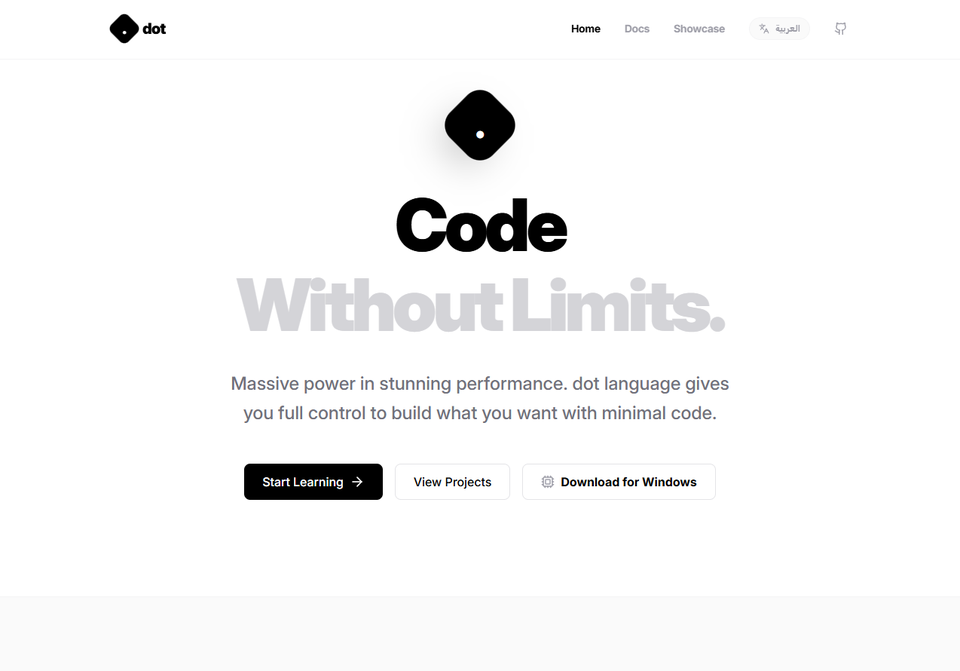
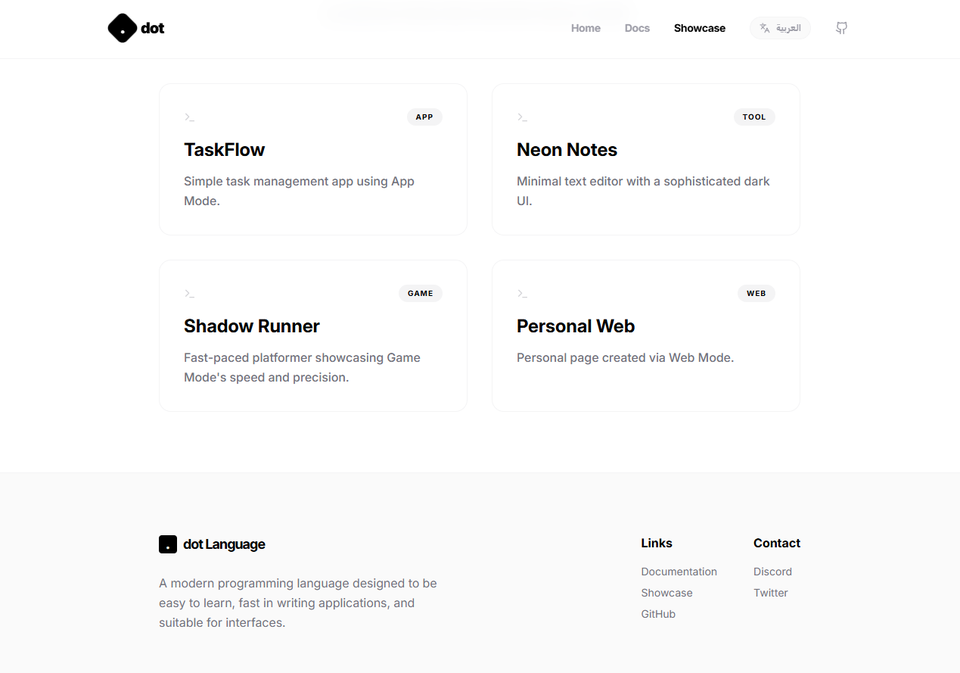
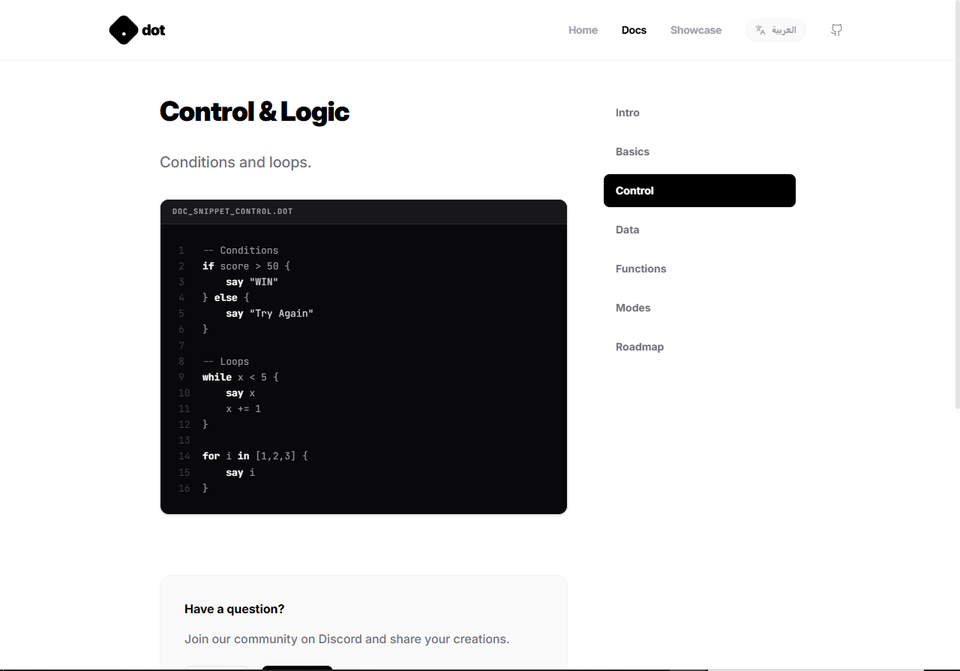

# dot Language | Minimalist General-Purpose Programming Language
> لغة برمجة حديثة، بسيطة، وعامة لتطوير الواجهات، المواقع، والألعاب بأقل كود ممكن.

---

## 📌 نبذة عن المشروع / Project Overview

**dot** هي لغة برمجة حديثة مصممة خصيصاً للجمع بين البساطة الفائقة والقوة الوظيفية. تخلت اللغة عن أسلوب التعقيد البرمجي لتقدم للمطورين بيئة برمجية نظيفة تركز على منطق التطبيق. يحتوي هذا المستودع على الموقع الرسمي للغة ومستندات التوثيق التفاعلية (Docs) مع أمثلة حية مدمجة تدعم مختلف أنماط التطوير (لألعاب المنصات، الواجهات البرمجية، وتطبيقات الويب)، مع مظهر بصري فاخر باللونين الأبيض والأسود ودعم كامل لكل من اللغتين العربية والإنكليزية.

**dot** is a modern, minimalist general-purpose programming language designed to strip away syntactic clutter and restore the joy of coding. This repository houses the official language gateway, interactive documentation (Docs Setup), and realistic execution visualizations. Styled in an ultra-sleek, minimalist premium black-and-white aesthetic, it features fully integrated Arabic/English translations, a high-ratio typography system, and dynamic execution mockups.

---

## 🎯 أهداف المشروع / Purpose of the Project

تم بناء وتطوير منصة وموقع لغة **dot** لتحقيق أفضل المعايير التقنية والخدمية:
- **تحقيق التوازن البصري والوظيفي**: واجهات بنقاء هندسي بالكامل (Pixel-Perfect B&W Minimalist Design).
- **سهولة التعلم السريع (Zero-Friction Documentation)**: مستندات تفاعلية مقسمة تدريجياً لتبسيط المفاهيم للمبتدئين ومحترفي البرمجة.
- **تعدد أنماط التشغيل (Multi-Mode Paradigm)**: إثبات إمكانيات اللغة في ثلاثة مجالات حيوية: الألعاب (Game Mode)، الويب (Web Mode)، والتطبيقات (App Mode).
- **العالمية ودعم ثقافة المستخدم**: هندسة تخطيط ديناميكي يدعم اتجاهات النصوص اليمينية واليسارية (RTL/LTR Layout Toggle).

---

## 🛠️ التقنيات المستخدمة / Technologies Used

- **React 19 & TypeScript**: لبناء بنية تحتية برمجية آمنة ومقاومة للأخطاء مع تفاعلية فائقة السرعة للمكونات.
- **Tailwind CSS**: لتوفير أسلوب تصميم حديث بلون أحادي رفيع المستوى للخطوط والعمق البصري.
- **Vite**: محرك التطوير الأسرع لبناء وتهيئة الملفات للإنتاج مع سرعة تصفح عالية.
- **Motion (motion/react)**: لتوفير استجابات حركية سلسلة للغاية تمنح انتقال الصفحات طابع الأنظمة الاحترافية السحابية.
- **Lucide Icons**: مكتبة أيقونات مرنة ومحدثة لتعزيز شمولية الخصائص والمفاتيح البصرية.

---

## 💎 مزايا ميزّات اللغة والموقع / Key Features

### 1. أنماط التطوير المتعددة (Integrated Development Modes)
* **نمط الألعاب (Game Mode) 🎮**: يدعم كود كامل لبناء عالم ألعاب فيزيائي، جاذبية، حواجز تفاعلية، أعداء تلقائيين، وتجميع العملات الذهبية مع كاميرا تتبع اللاعب تلقائياً.
* **نمط التطبيقات (App Mode) 📱**: أدوات واضحة لتنصيب واجهات برمجية، إعداد خلفيات وأزرار وعناوين تفاعلية بالكامل.
* **نمط الويب (Web Mode) 🌐**: صياغة مباشرة لبناء هيكليات مواقع إنترنت سريعة بفقرات وعناوين ممتازة.

### 2. محاكاة المحرك والعرض البصري (Engine Execution Preview)
* يتميز الموقع بعرض حي للعبة المنصات الشهيرة **Shadow Runner** مكتوبة بلغة **dot** مباشرة، وبجانبها المحاكي الافتراضي الذي يعكس مظهر التشغيل الفوري والواجهة البصرية للغة، مما يمنح الزائرين فهماً فورياً لسهولة إنتاج الألعاب فيها.

### 3. دعم ثنائي اللغة ذكي (Seamless English/Arabic Bi-Directional Engine)
* بضغطة زر واحدة، تتحقق مزامنة بصرية كاملة لجميع واجهات وتفاصيل الموقع.
* يتم قلب اتجاهات التصفح بالكامل (RTL <=> LTR) للتوافق مع شروط محركات البحث وقراءة النصوص العربية والإنجليزية بشكل مريح وطبيعي جداً.

### 4. التنزيل والبدء الفوري (Direct Developer Actions)
* زر مخصص لتنزيل مفسر ومترجم لغة **dot** لنظام التشغيل ويندوز (Windows) مدمج بشكل أنيق بجوار أزرار المشاريع والمستندات لتسهيل عملية البدء الفوري بكتابة الكود البرمجي للمبرمجين الجدد.

---

## 📸 لقطات من داخل الموقع / Project Screenshots

* **شاشة الرئيسية (Main )**
  

* **صفحة المشاريع (showcase)**
  

* **صفحة الـdocs (docs)**
  

---

## 📈 الدروس والمهارات المكتسبة / Developer Insights

- ابتكار معايير واجهات مستخدم أحادية وبسيطة (Minimalist UX Paradigm) تُظهر فخامة المنتج دون تشتيت انتباه المبرمج.
- بناء نظام معالجة اللغات المزدوجة ومزامنة الاتجاهات الهندسية الفورية وعكس العناصر بشكل نظيف في React.
- صياغة شيفرات برمجية تفاعلية للغة وهمية لتوضيح سهولة مفسر الأكواد الخاص بها للمستعملين والمهتمين.

---

## 💬 تواصل مع المطور / Contact Information

للمشاركة في تطوير اللغة، الاستفسار، أو دعم المشروع، يرجى التواصل مباشرة عبر قنوات المطور الرسمية:

* **Telegram**: [👉 @zg22x](https://t.me/zg22x)
* **GitHub Repository**: [👉 zg22x/DOT](https://github.com/zg22x/DOT)
